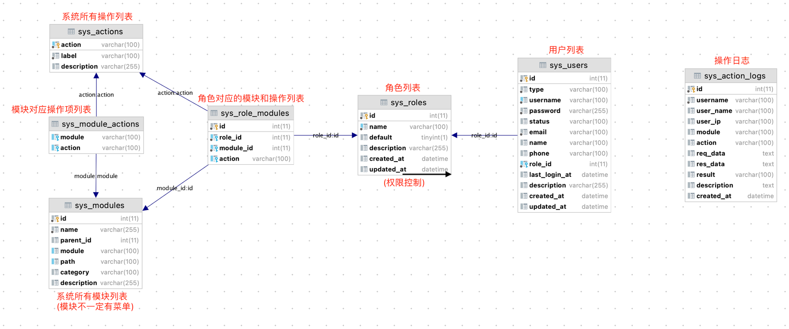

## 系统权限设计

### 功能设计


系统采用基于角色的权限控制(RBAC)

1. 用户跟角色相关联，采用的是单角色模式(一个用户只跟一个角色关联)
2. 角色跟模块权限+操作权限关联

权限检查步骤如下：

1. 获取当前用户(current_user)
2. 根据当前用户找到对应的角色
3. 将模块+操作和角色中的进行比较，如果角色拥有对应的模块+操作权限，则检查通过，否则检查失败

### 模型设计



权限控制模块的数据模型和关系如下

- sys_actions: 存储系统所有操作列表(例如)创建/编辑/删除/系统配置)
- sys_modules: 存储所有系统模块列表
    - module: 用于API和权限控制
    - path: 用于页面导航，只有用path属性的模块才会出现在前端菜单中
    - parent_id: 父模块id，一般用于菜单层级控制
- sys_module_actions: 模块对应的操作列表，模块根据功能可以设置不同的操作
- sys_roles: 系统角色菜单
- sys_role_modules:角色拥有的模块+操作权限列表
- sys_users: 系统用户列表，用户通过role_id和角色关联，从而进行权限控制

以上功能实现和数据库设计，请参考[sys_mgmt/model.py](../../app/sys_mgmt/model.py)

### API访问控制

系统通过`ModelRestManager`进行API相关的权限控制

```python
from flaskz.rest import ModelRestManager

model_rest_manager = ModelRestManager()
# 登录检查
model_rest_manager.login_check(auth.login_check)
# 模块&操作权限检查
model_rest_manager.permission_check(auth.permission_check)
# 初始化
model_rest_manager.init_app(app)
```

设置好了login_check和permission_check以后，就可以通过@rest_login_required和@rest_permission_required为API添加权限控制

```python
@sys_mgmt_bp.route('/auth/account/', methods=['GET', 'POST'])
@rest_login_required()  # 登录用户才可以访问，否则abort(401, response='unauthorized')
def sys_auth_account_query():
    pass


@sys_mgmt_bp.route('/roles/', methods=['GET'])
@rest_permission_required('roles')  # 当前用户对应的角色有roles模块的访问权限才可以访问，否则abort(403, response='forbidden')
def sys_role_query():
    pass


@sys_mgmt_bp.route('/roles/', methods=['POST'])
@rest_permission_required('roles', 'add')  # 当前用户对应的角色有roles模块的访问+添加权限才可以访问，否则abort(403, response='forbidden')
def sys_role_add():
    pass
```

## License功能设计

### 功能设计

##### 服务器端

1. License信息存放在**数据库**中，以方便License上传处理和HA多机部署
2. 多License并存，符合当前日期的最新的License会起作用，同时会合并计算到期时间(前端使用)
3. 同一个License只允许上传一次
4. License缓存，默认每10分钟重新加载一次，以减少License相关损耗，提高效率
5. request请求回调中对License进行校验(根据项目情况定制校验)，如果校验失败则返回相关信息
6. 如果没有符合的License，只返回"Licenses"菜单(需要用户有菜单访问权限)

##### 浏览器/前端

1. 加载的账号信息中包含License相关信息
2. 如果没有或没有符合当前日期的License，前端只显示"Licenses"菜单(后端返回)
3. 如果License即将到期，前端会进行告警提示
4. License管理模块，只提供上传功能，不提供更改/删除等操作

##### License文件

文件有两部分组成

1. 授权信息
2. 授权信息签名

```ini
User = Cisco                # 授权用户
Type = EVALUATION           # License类型
StartDate = 2021/9/9        # 开始时间
EndDate = 2022/9/9          # 结束时间
Modules = *,firewall,f5     # 系统模块
Device = 20                 # 其他控制信息(设备数/服务器地址/...)

Signature = CA0U7lviZp..    # 签名
```

文件一经生成**不得修改**，否则会验签失败

License有如下类型:

- EVALUATION - 评估版，用于Demo演示/功能验证，在系统前端页面显示授权信息水印
- RUNTIME - 运行版，用于正式上线部署，不显示水印

### 功能实现

##### License文件上传

上传过程如下:

1. 检查Liencse的合法性(**公钥验签**)
2. License信息入库(修改数据库中的License信息，也会导致验签失败)

##### 启用License控制功能

系统通过`LicenseManager`启用权限控制功能

```python
# APP_LICENSE_PUBLIC_KEY_FILEPATH = './_license/public.key' # 默认公钥目录

from .sys_mgmt import license

license_manager = license.LicenseManager()
license_manager.load_license(license.load_license)  # License加载函数(可自定义)
license_manager.request_check(license.request_check_by_license)  # 请求时License检查函数(可自定义)
license_manager.init_app(app)  # 启用License功能
```

默认会对API请求进行检查，如果系统当前没有可用的License会返回`license_not_found`提示

如果其他业务操作需要检查系统License信息，可以通过[get_app_license](../../app/utils/_app.py)函数获取&使用